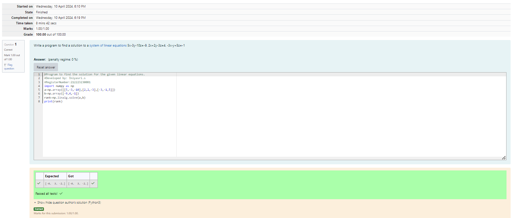

# -SOLUTION-TO-A-SYSTEM-OF-LINEAR-EQUATIONS
## Aim:
To write a python program to find a solution to a system of linear equations.
## Equipment’s required:
1. 	Hardware – PCs
2. 	Anaconda – Python 3.7 Installation / Moodle-Code Runner
## Algorithm:
### Step 1: 
Import the numpy module to use the built-in functions for calculation
### Step 2: 
Prepare the lists from each linear equations and assign in np.array()
### Step 3: 
Using the np.linalg.solve(), we can find the solutions.
### Step 4: 
End the program
## Program:
```
#Program to find the rank of a matrix.
#Developed by: Iniyasri.s
#RegisterNumber:212223230081
import numpy as np
a=np.array([[3,2,5],[1,1,2],[3,3,6]])
rank=np.linalg.matrix_rank(a)
print(rank)
```
## Output:

## Result: 
Thus the solutions for the linear equations are successfully solved using python program

